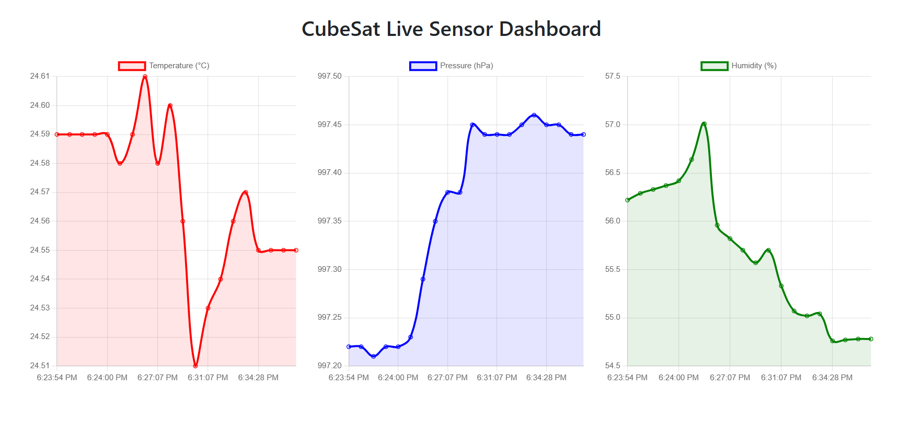

# ESP32 BME688 Sensor Webserver

This project reads **temperature**, **pressure**, and **humidity** data from a **BME688** sensor connected to an **ESP32-S3 WROOM-1** module over I2C. The ESP32 hosts a web server that displays real-time graphs of the sensor data using Chart.js.

## 📦 Features

- Live sensor data from the BME688
- Web-based dashboard using HTML + Chart.js
- Graphs for temperature, pressure, and humidity
- Auto-updating every 2 seconds

---

## 🔧 Hardware Setup

### Components Required:
- ESP32-S3 WROOM-1
- BME688 sensor module (I2C)
- Jumper wires
- Micro-USB cable

### Wiring (I2C connection):

| BME688 Pin | ESP32 GPIO | Description    |
|------------|------------|----------------|
| VCC        | 3.3V       | Power          |
| GND        | GND        | Ground         |
| SDA        | GPIO 8     | I2C Data       |
| SCL        | GPIO 9     | I2C Clock      |

> ⚠️ Make sure the sensor is operating at 3.3V logic level to match the ESP32.

---

## 🧰 Dependencies

Install the following libraries in the Arduino IDE:

1. **Adafruit BME680 Library**  
   Library Manager: `Adafruit BME680`
2. **Adafruit Unified Sensor Library**  
   Library Manager: `Adafruit Unified Sensor`
3. **ESP32 Board Support Package**  
   Board Manager URL: `https://raw.githubusercontent.com/espressif/arduino-esp32/gh-pages/package_esp32_index.json`

---

## 🌐 Network Configuration

Update the following in the code before uploading:

```cpp
const char* ssid = "YOUR_SSID";
const char* password = "YOUR_PASSWORD";
```

---

## 🚀 Upload and Use

- Open the project in Arduino IDE.

- Select your board: ESP32S3 Dev Module. (or Nologo ESP32C3 Super mini)

- Select the correct COM port.

- Upload the sketch.

- Open the Serial Monitor to get the ESP32’s IP address.

- Visit the IP address in your browser (e.g., http://192.168.1.42).

You’ll see real-time temperature, pressure, and humidity plots.

--- 

## 📊 Screenshot


---

## 🧠 Notes
The BME688 also supports gas detection and AI-based features, but this code focuses on environmental sensing only.

Graphs update every 1 seconds and show up to 20 recent data points.

## 🛠 Future Improvements
- Add gas sensing and IAQ support using the Bosch BSEC library.

- Support data export to CSV or cloud.

- Mobile-responsive layout.

## 📝 License
MIT License. Use freely with attribution.